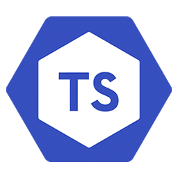

## Amazing or Annoying?
I wouldn't say that typescript significantly amazes or annoys me. Whether TypeScript is the best choice depends on the project at hand. For instance, if performance is a priority, C++ may still reign supreme, while for cross-platform development, other tools like React Native, Kotlin, or Flutter could be more appropriate. In small applications/scripts where those kinds of things don’t matter at all, I would choose a different language, which syntax I know better. 

## Typescripting gamechanger 
As for me, typescript is an extra layer of protection and productivity on JavaScript,  which can be invaluable in certain projects. However, I think it’s not a game-changer as it doesn't offer the raw speed of C++ or the simplicity of Python, so it fits best in specific use cases.

##WODs
As for athletic software engineering and the practice WODs (Workout of the Day), I found the hands-on learning style to be engaging. While it adds an element of pressure, it also forces you to think quickly and adapt. Personally, I find this style of learning enjoyable because it breaks the monotony of traditional learning methods, and hope to find interesting and harder WODs in the future.

## Lovely citations
1) Languages are tools. Use whatever is best for the given circumstance
2) The right language is the one that you know
