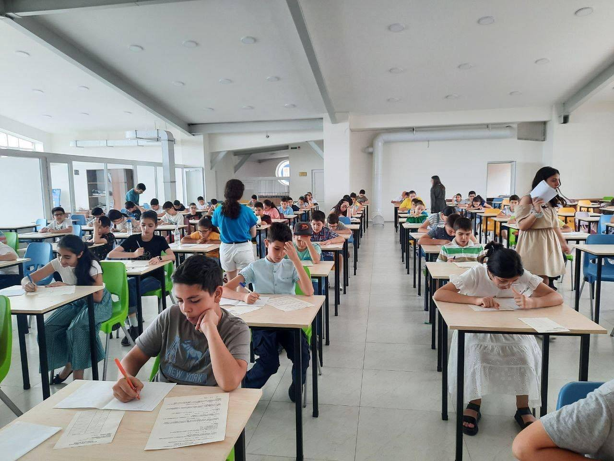

Edure is an unpublished learning management system. It utilizes Flutter/dart for the front end part and Python/flask with SQL lite for the back end part.
It is currently in the frozen developing stage, however, the most important systems are already developed. It has a unique permission system, data structure, and Course management system.

