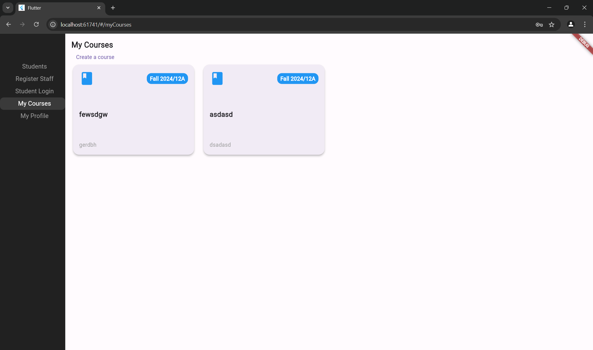

In this project, under the Maroon&Gold network micro internship program and for Kelly O'Connell Inc., I built a fully functional website from the ground up using WordPress and SQL, incorporating analytical features to enhance user experience and data insights. I revamped the hosting file system, removing malware scripts, which led to a 20% reduction in operational expenses. Additionally, I implemented SEO strategies that elevated the site to a top 5 ranking in search engine results, significantly increasing web traffic. To streamline operations, I integrated third-party services, automating workflows and reducing manual efforts.

